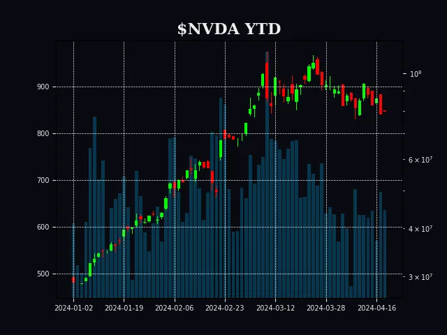

# StockBot

## Description

StockBot is a Discord bot designed to retrieve financial information and create charts for stocks, ETFs, and cryptocurrencies.
With StockBot, users can quickly access financial data and visualize the performance of various assets directly within their Discord server.

## Table of Contents

- [Description](#description)
- [Features](#features)
- [Usage](#usage)
- [Commands](#commands)
- [Example Chart](#example-chart)
- [Contributions](#contributions)

## Features

- **Financial Data**: StockBot provides up-to-date financial information for stocks, ETFs, and cryptocurrencies, allowing users to stay informed about market trends.
- **Chart Creation**: StockBot generates charts based on the requested ticker symbols, allowing users to visualize the historical performance of assets over different time frames.
- **Versatile Usage**: Whether you're a seasoned investor or just curious about financial markets, StockBot caters to users of all experience levels by providing comprehensive data in a user-friendly format.

## Usage

To use StockBot, simply invite it to your Discord server and start interacting with it using commands.
**Invite Link:** https://discord.com/oauth2/authorize?client_id=1228479090084937728&permissions=274877967424&scope=bot

### Commands

- **!ticker** Retreive financial information on the provided Ticker
  `!ticker [ticker]`
- **!etf** Retreive ETF information on the provided ETF
  `!etf [ticker]`
- **!coin** Retreive cryptocurrency information about the provided coin
  `!coin [ticker]`
- **!chart** Create a chart based on the user provided ticker\n Works on Stocks, ETFs, & Crypto
  `!chart [ticker]`

- For a full list of commands and their usage, type `!help` in your Discord server.

### Example Chart

## Support and Feedback

If you encounter any issues or have suggestions for improving StockBot, please feel free to open an issue on GitHub. Your feedback is valuable and helps to enhance the bot for all users.
